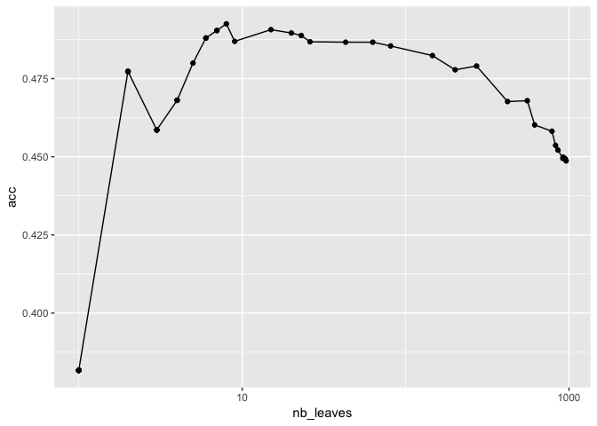
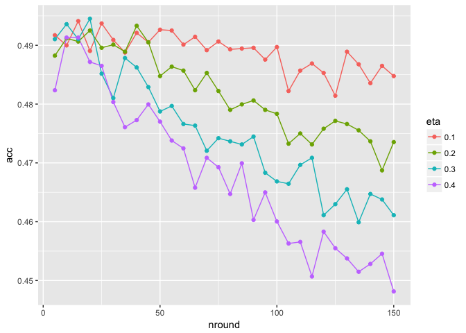
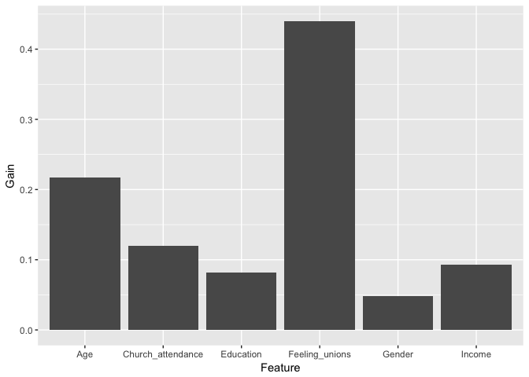
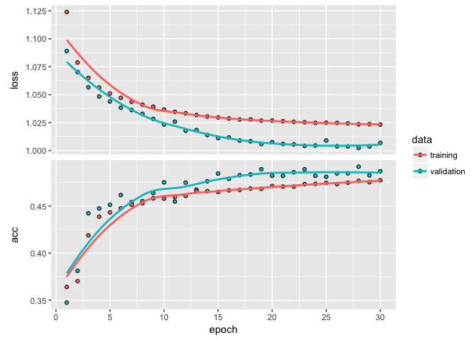

Classification with political data
================
Guillaume Coqueret

The following document shows the potential of classification tools applied to political data. The examples are simple illustrations that can be generalized to much more ambitious studies.

We refer to the companion paper (*Supervised learning with political data* by Guillaume Coqueret) for comments on the results below, **as well as for the presentation of the database**.

------------------------------------------------------------------------

**DISCLAIMER**: the data and code are meant for pedagogical and research use only. The original collector of the data, ANES, and the author bear no responsibility for use of the data or for interpretations or inferences based upon such uses.

------------------------------------------------------------------------

The script requires a large number of packages. You can copy-paste the line below to install most of them. install.packages(c("tidyverse", "rpart.plot", "xgboost", "e1071", "keras", "dummies"))

Additionally, the section on neural networks requires the installation of a recent version of Python.

**THE TASK** is to predict the party affiliation based on the following variables: Age, Gender, Education, Income, Church\_attendance, and Feeling\_unions. **TRAINING SET**: 1986-2008, **TESTING SET: 2012-2016**.

Data preparation
----------------

``` r
library(tidyverse)
library(rpart)
library(rpart.plot)
load("anes.RData")    # Import ANES database
beg_train <- 1985     # Start date for training sample
end_train <- 2010     # End date for training sample (and beginning for testing sample)
vars <- c("Age", "Gender", "Education", "Income", "Church_attendance", "Party_simple", "Feeling_unions")
train <- anes %>% filter(Date < end_train & Date >= beg_train) %>% select(vars)
test <- anes %>% filter(Date > end_train) %>% select(vars)
train <- train %>% filter(rowSums(is.na(train))==0)                                   # Remove rows with NAs
test <- test %>% filter(rowSums(is.na(test))==0)                                      # Remove rows with NAs
```

Classification trees
--------------------

We start with a simple tree.

``` r
fit <- rpart(Party_simple ~ ., data = train, cp = 0.006)  # Fit the tree
rpart.plot(fit)                                           # Plot the tree
```


``` r
pred <- predict(fit, test, type = "vector")           # Vector of predicted values
sum(pred == as.numeric(test$Party_simple))/nrow(test) # Simple computation of accuracy
```

    ## [1] 0.4879711

Then we look at the impact of the number of leaves on accuracy.

``` r
class_tree_cp <- function(train, test, cp){                 # Function that allows to easily change the complexity (cp) of the tree (& the number of leaves)
  fit <- rpart(Party_simple ~ ., data = train, cp = cp)
  pred <- predict(fit, test, type="vector")
  x <- c()
  x$acc <- sum(pred==as.numeric(test$Party_simple))/nrow(test)      # Accuracy
  x$nb <- sum(fit$frame$var=="<leaf>")                              # Number of leaves
  return(x)
}

cp <- 0.8^(1:48) # complexity of the tree, small= more complex & more leaves
# The line below may take some time
acc <- cp %>% map(~class_tree_cp(train = train, test = test, .x)) %>% unlist() %>% matrix(ncol = 2, byrow = T)
df <- data.frame(cp, acc)
colnames(df)[2:3] <- c("acc","nb_leaves") 
ggplot(df,aes(nb_leaves, acc)) + geom_line() + geom_point() + scale_x_log10() 
```



Let's see if we can do better with boosted trees!

NOTE: categorical variables are ordered, so we do not resort to one-hot encoding.

``` r
library(xgboost)
train_data <- train %>% select(-Party_simple) 
test_data <- test %>% select(-Party_simple)
i <- sapply(train_data, is.factor)                                      # Find non-numerical (factor) columns
train_data[i] <- sapply(train_data[i], as.numeric)                      # Digitize factors
train_data <- train_data %>% data.matrix()       
test_data[i] <- sapply(test_data[i], as.numeric)                        # Digitize factors
test_data <- test_data %>% data.matrix()
train_label <- train$Party_simple %>% as.numeric() %>% matrix()
test_label <- test$Party_simple %>% as.numeric()  %>% matrix()
train_matrix <- xgb.DMatrix(data = train_data, label = train_label -1)  # xgboost convention: classes start at 0, hence -1
test_matrix <- xgb.DMatrix(data = test_data, label = test_label -1)     # xgboost convention: classes start at 0, hence -1

boosted_class_tree <- function(train, test, nround, eta){               # Function => automation
  fit <- xgb.train(eta = eta, objective = "multi:softmax",
                   subsample = 0.8,
                   num_class = 3, data = train_matrix, 
                   nrounds = nround, verbose = 1)
  pred <- predict(fit, test_matrix) + 1
  return(sum(pred==test_label)/length(test_label))
}

nround <- 5*(1:30)                  # Number of trees
eta <- 0.1*(1:4)                    # Learning rate
pars <- expand.grid(nround, eta)
nround <- pars[,1]
eta <- pars[,2]
# The line below will take time
df <-  map2(nround, eta, boosted_class_tree, train = train_matrix, test = test_matrix) %>% unlist()
df <- data.frame(pars, df)
colnames(df) <- c("nround", "eta", "acc")
df$eta <- df$eta %>% as.factor()
ggplot(df,aes(nround, acc, color=eta)) + geom_line() + geom_point()
```



Below, we show which variables play dominant roles (in explaning/forcasting Party\_simple) for one example of boosted tree.

``` r
fit <- xgb.train(eta = 0.1, objective = "multi:softmax", num_class = 3,   # Fit one tree
          data = train_matrix, nrounds = 20) 
importance <- xgb.importance(model = fit)                                 # Keep the importance of variables
feat <- colnames(train_data)[as.numeric(importance$Feature)+1]            # Features start at 0, hence +1
importance <- data.frame(feat, importance$Gain)
colnames(importance) <- c("Feature", "Gain")
ggplot(importance,aes(x=Feature, y=Gain)) + geom_bar(stat = "Identity") 
```



Support Vector Machines
-----------------------

We now turn to SVMs. The purpose is to investigate the impact of kernels and cost parameters.

``` r
library(e1071)
svm_e1071 <- function(train, test, cost, kern){
  print(kern) # This line allows to track the progress in the map2 function below: it can be deleted
  fit <- svm(Party_simple ~ ., data = train, kernel = kern, cost = cost, cachesize = 1000, tolerance = 0.005)
  pred <- predict(fit, test)
  return(sum(as.numeric(pred)==as.numeric(test$Party_simple))/nrow(test))
}

kern <- c("linear", "polynomial", "radial", "sigmoid")  # Possible SVM kernels
cost <- exp(seq(-2,5,0.6))                              # Cost / regularization
pars <- expand.grid(kern, cost)
kern <- pars[,1]
cost <- pars[,2]
# Again, the line below is VERY time-consuming 
df <-  map2(cost, kern, svm_e1071, train = train, test = test) %>% unlist() 
df <- data.frame(pars, df)
colnames(df) <- c("kernel", "cost", "acc")
df$kernel <- df$kernel %>% as.factor()
ggplot(df,aes(cost, acc, color = kernel)) + geom_line() + geom_point() + scale_x_log10()
```


Articifial Neural Networks
--------------------------

We stick to the simplest case: the multilayer perceptron. We plot the improvement of the accuracy based on the number of rounds of back-propagation.

``` r
library(dummies)  # For one-hot encoding
library(keras)
install_keras()   # This takes a few seconds
train_ann <- train_data
test_ann <- test_data
# Below, we scale the two variables that can reach high values / the other variables too could be normalized
# Also, it is done in a hard-coded manner (first and sixth columns), which is dangerous
train_ann[,1] <- train_data[,1] / 100
train_ann[,6] <- train_data[,6] / 100
test_ann[,1] <- test_data[,1] / 100
test_ann[,6] <- test_data[,6] / 100
train_label <- train$Party_simple %>% dummy() # One-hot encoding
test_label <- test$Party_simple %>% dummy()   # One-hot encoding

model <- keras_model_sequential()
model %>%                                 # This defines the structure of the network, i.e. how layers are organized
  layer_dense(units = 32, activation = 'relu', input_shape = c(ncol(train_data))) %>%
  layer_dense(units = 16, activation = 'sigmoid') %>%
  layer_dense(units = 3, activation = 'softmax')

model %>% compile(                        # This provides further details on how the model is trained
  loss = 'categorical_crossentropy',
  optimizer = optimizer_rmsprop(),
  metrics = c('accuracy')
)

ann <- model %>% fit(train_ann, train_label, epochs = 30, batch_size = 16, validation_data = list(test_ann, test_label))
plot(ann)
```



**CONCLUSION**: 50% accuracy is a hard ceiling to beat!
