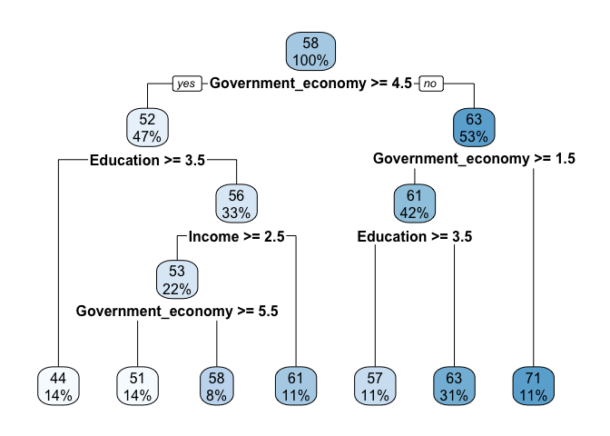
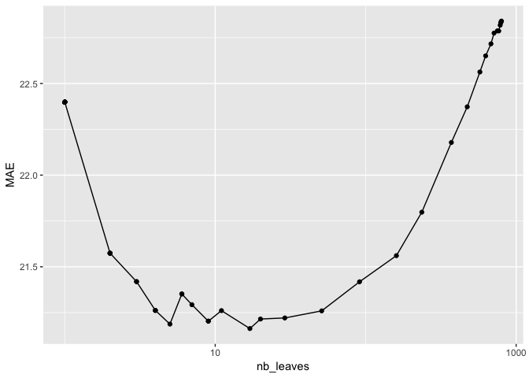
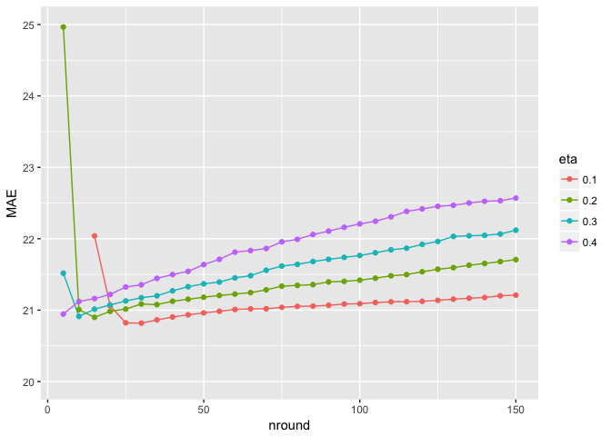
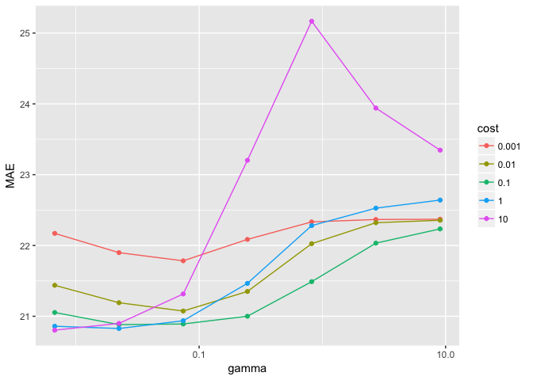

The following document shows the potential of regression analysis
applied to political data. The examples are simple illustrations that
can be generalized to much more ambitious studies.

We refer to the companion paper (*Supervised learning with political
data* by Guillaume Coqueret) for comments on the results below, **as
well as for the presentation of the database**.

------------------------------------------------------------------------

**DISCLAIMER**: the data and code are meant for pedagogical and research
use only. The original collector of the data, ANES, and the author bear
no responsibility for use of the data or for interpretations or
inferences based upon such uses.

------------------------------------------------------------------------

The script requires a large number of packages. You can copy-paste the
line below to install most of them. install.packages(c("tidyverse",
"rpart.plot", "xgboost", "e1071", "keras", "dummies"))

Additionally, the section on neural networks requires the installation
of a recent version of Python.

**THE TASK** is to predict the feeling towards unions based on the
following variables: Age, Gender, Education, Income, Church\_attendance,
Home\_ownership, Abortion, Feeling\_unions, Foreign\_policy, and
Government\_economy. **TRAINING SET**: 1986-2008, **TESTING SET**:
2012-2016.

Data preparation
----------------

    library(tidyverse)
    load("anes.RData")    # Import ANES database
    beg_train <- 1985     # Start date for training sample
    end_train <- 2010     # End date for training sample (and beginning for testing sample)
    vars <- c("Age", "Gender", "Education", "Income", "Church_attendance", "Home_ownership", "Abortion", "Feeling_unions", "Foreign_policy", "Government_economy")
    train <- anes %>% filter(Date > beg_train & Date < end_train) %>% select(vars)
    test <- anes %>% filter(Date > end_train) %>% select(vars)
    i <- sapply(train, is.factor)                       # Find non-numerical (factor) columns
    train[i] <- sapply(train[i], as.numeric)            # Digitize factors
    test[i] <- sapply(test[i], as.numeric)              # Digitize factors
    train <- train %>% filter(rowSums(is.na(train))==0) # Remove rows with NAs
    test <- test %>% filter(rowSums(is.na(test))==0)    # Remove rows with NAs

Linear regression
-----------------

    fit <- lm(Feeling_unions ~ ., data = train)
    summary(fit)

    ## 
    ## Call:
    ## lm(formula = Feeling_unions ~ ., data = train)
    ## 
    ## Residuals:
    ##     Min      1Q  Median      3Q     Max 
    ## -80.207 -14.689  -0.901  16.767  59.371 
    ## 
    ## Coefficients:
    ##                    Estimate Std. Error t value Pr(>|t|)    
    ## (Intercept)        84.94495    2.27960  37.263  < 2e-16 ***
    ## Age                -0.02701    0.01551  -1.742   0.0816 .  
    ## Gender              2.12366    0.50085   4.240 2.25e-05 ***
    ## Education          -4.07718    0.30674 -13.292  < 2e-16 ***
    ## Income             -2.19488    0.25863  -8.487  < 2e-16 ***
    ## Church_attendance  -0.02960    0.16862  -0.176   0.8607    
    ## Home_ownership      0.82113    0.58431   1.405   0.1600    
    ## Abortion            0.20731    0.25060   0.827   0.4081    
    ## Foreign_policy     -0.38553    0.57885  -0.666   0.5054    
    ## Government_economy -2.86120    0.13734 -20.833  < 2e-16 ***
    ## ---
    ## Signif. codes:  0 '***' 0.001 '**' 0.01 '*' 0.05 '.' 0.1 ' ' 1
    ## 
    ## Residual standard error: 24.1 on 9806 degrees of freedom
    ## Multiple R-squared:  0.1064, Adjusted R-squared:  0.1056 
    ## F-statistic: 129.7 on 9 and 9806 DF,  p-value: < 2.2e-16

Performance metric: the Mean Absolute Error, which we compute below.

    outlier.rm <- function(x){ # Removes outliers
      x[x>100] <- 100
      x[x<0] <- 0
      return(x)
    }
    fit <- lm(Feeling_unions ~ ., data = train)
    pred <- outlier.rm(predict(fit,test))
    mean(abs(pred-test$Feeling_unions),na.rm=T)

    ## [1] 21.22539

Regression trees
----------------

A simple tree:

    library(rpart)
    library(rpart.plot)
    fit <- rpart(Feeling_unions ~ ., data = train, cp = 0.003)
    rpart.plot(fit)

Sensitivity to the number of leaves:

    reg_tree_cp <- function(train, test, cp){                   # Function for automation
      fit <- rpart(Feeling_unions ~ ., data = train, cp = cp)   # Fits the tree
      pred <- predict(fit, test, type="vector")                 # Computes the predicted values
      x <- c()
      x$MAE <- mean(abs(pred-test$Feeling_unions))              # Computes the MAE
      x$nb <- sum(fit$frame$var=="<leaf>")                      # Computes the number of leaves
      return(x)
    }

    cp <- 0.8^(1:48)    # Complexity of the tree
    # The line below may take some time
    MAE <- cp %>% map(~reg_tree_cp(train = train, test = test, .x)) %>% unlist() %>% matrix(ncol = 2, byrow = T)
    df <- data.frame(cp, MAE)
    colnames(df)[2:3] <- c("MAE","nb_leaves") 
    ggplot(df,aes(nb_leaves,MAE)) + geom_line() + geom_point() + scale_x_log10() 

Boosted trees
-------------

Can we do better?

    library(xgboost)
    train_data <- train %>% select(-Feeling_unions) 
    test_data <- test %>% select(-Feeling_unions)
    i <- sapply(train_data, is.factor)                  # Find non-numerical (factor) columns
    train_data[i] <- sapply(train_data[i], as.numeric)  # Digitize factors
    train_data <- train_data %>% data.matrix()       
    test_data[i] <- sapply(test_data[i], as.numeric)    # Digitize factors
    test_data <- test_data %>% data.matrix()
    train_label <- train$Feeling_unions %>% as.numeric() %>% matrix()
    test_label <- test$Feeling_unions %>% as.numeric()  %>% matrix()
    train_matrix <- xgb.DMatrix(data = train_data, label = train_label) # XGBoost matrix format
    test_matrix <- xgb.DMatrix(data = test_data, label = test_label)    # XGBoost matrix format

    boosted_reg_tree <- function(train,test,nround,eta){                # Function => automation
      fit <- xgb.train(eta = eta, objective = "reg:linear",
                       data = train_matrix, 
                       nrounds = nround)
      pred <- predict(fit, test_matrix)
      return(mean(abs(pred-test_label)))
    }

    nround <- 5*(1:30)                  # Number of trees
    eta <- 0.1*(1:4)                    # Learning rate
    pars <- expand.grid(nround, eta)
    nround <- pars[,1]
    eta <- pars[,2]
    # The following command may take some time
    df <-  map2(nround, eta, boosted_reg_tree, train = train_matrix, test = test_matrix) %>% unlist()
    df <- data.frame(pars, df)
    colnames(df) <- c("nround", "eta", "MAE")
    df$eta <- df$eta %>% as.factor()
    ggplot(df,aes(nround, MAE, color=eta)) + geom_line() + geom_point() + ylim(20,25)

Which variables matter most? Let's see:

    fit <- xgb.train(eta = 0.1, objective = "reg:linear", num_class = 1,   # Fit one tree
              data = train_matrix, nrounds = 20) 
    importance <- xgb.importance(model = fit) 
    feat <- colnames(train_data)[as.numeric(importance$Feature)+1]            # Features start at 0, hence +1
    data.frame(feat, importance$Gain)

    ##                 feat importance.Gain
    ## 1 Government_economy      0.42897738
    ## 2          Education      0.20452515
    ## 3                Age      0.13590199
    ## 4             Income      0.10020379
    ## 5  Church_attendance      0.04401488
    ## 6             Gender      0.02734371
    ## 7           Abortion      0.02560311
    ## 8     Home_ownership      0.01736229
    ## 9     Foreign_policy      0.01606770

Support Vector Machines
-----------------------

    library(e1071)
    gamma <- exp(seq(-5, 3, 1.2))          # Radial kernel parameter
    cost <- c(0.001, 0.01, 0.1, 1, 10)     # Cost / regularization parameter
    pars <- expand.grid(gamma, cost)
    gamma <- pars[,1]
    cost <- pars[,2]

    svm_2 <- function(train, test, gamma, cost){
      print(gamma) # This line allows to track the progress in the map2 function below: it can be deleted
      fit <- svm(Feeling_unions ~ ., data = train, kernel = 'radial', gamma = gamma, cost = cost, cachesize = 1000, tolerance = 0.005)
      pred <- outlier.rm(predict(fit, test))
      return(mean(abs((pred-test$Feeling_unions))))
    }

    # The line below is VERY time-consuming on regular computers
    df <-  map2(gamma, cost, svm_2, train = train, test = test) %>% unlist() 
    df <- data.frame(pars, df)
    colnames(df) <- c("gamma", "cost", "MAE")
    df$cost <- df$cost %>% as.factor()
    ggplot(df,aes(gamma, MAE, color = cost)) + geom_line() + geom_point() + scale_x_log10()

Neural networks
---------------

We stick to the simplest case: multilayer perceptron. We plot the
improvement of the MAE based on the number of rounds of
back-propagation.

    library(keras)
    # install_keras()  # If need be; this takes a few seconds
    train_ann <- train_data
    test_ann <- test_data
    # Below we scale Age and Feeling_blacks in a hard-coded manner => beware!
    train_ann[,1] <- train_data[,1] / 100
    train_ann[,6] <- train_data[,6] / 100
    test_ann[,1] <- test_data[,1] / 100
    test_ann[,6] <- test_data[,6] / 100
    model <- keras_model_sequential() 
    model %>% 
      layer_dense(units = 32, activation = 'relu', input_shape = c(ncol(train_data))) %>%
      layer_dense(units = 16, activation = 'sigmoid') %>%
      layer_dense(units = 1)

    model %>% compile(
      loss = 'mean_absolute_error',
      optimizer = optimizer_rmsprop(),
      metrics = c('mean_absolute_error')
    )

    ann <- model %>% fit(train_ann, train_label/100, epochs = 40, batch_size = 4, validation_data = list(test_ann, test_label/100))
    plot(ann) # Note: the MAE is divided by 100

**CONCLUSION**: using the training sample average to predict all
Feeling\_unions gives an MAE of 22.2. The best we could do here is 19.9,
which is only a marginal improvement. Adding more variables (e.g., party
affiliation or feelings) can help further reduces the MAE.
