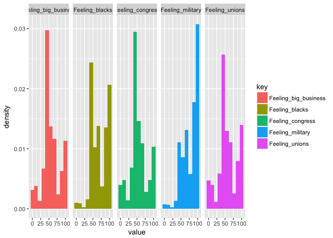
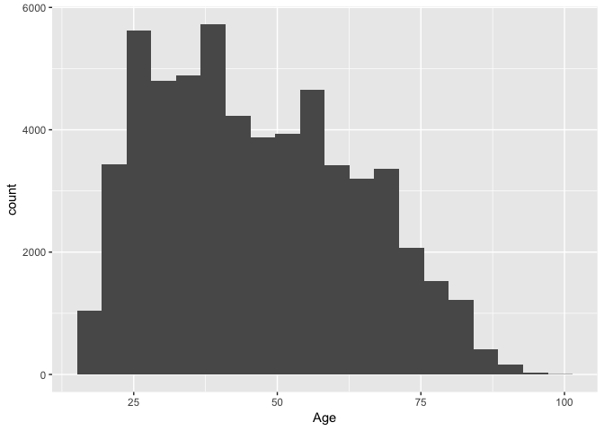
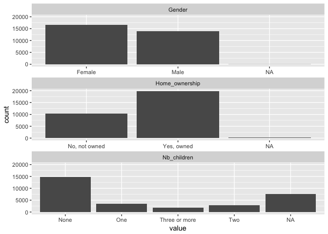
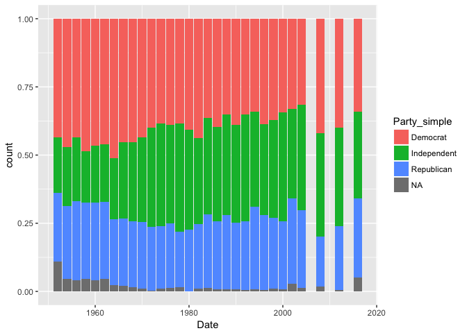

Datavisualization with political data
================
Guillaume Coqueret

The following document shows the potential of datavisualization applied to political data. The examples are simple illustrations that can be generalized to much more ambitious studies.

We refer to the companion paper (*Supervised learning with political data* by Guillaume Coqueret) for comments on the results below, **as well as for the presentation of the database**.

------------------------------------------------------------------------

**DISCLAIMER**: the data and code are meant for pedagogical and research use only. The original collector of the data, ANES, and the author bear no responsibility for use of the data or for interpretations or inferences based upon such uses.

------------------------------------------------------------------------

Data preparation
----------------

``` r
library(tidyverse)
load("anes.RData")    # Import ANES database
beg <- 1985           # Start date for the sample
```

Plotting Feelings & Age
-----------------------

``` r
feel <- c("Feeling_blacks","Feeling_big_business","Feeling_unions","Feeling_military","Feeling_congress")
anes_feel <- anes %>% filter(Date > beg) %>%  select(one_of(feel)) %>% gather()
ggplot(anes_feel, aes(x = value, y = ..density.. , fill = key)) + geom_histogram(bins = 10) + facet_grid(. ~ key)
```



``` r
ggplot(anes, aes(x = Age)) + geom_histogram(bins = 20)
```



Representing demographical data
-------------------------------

``` r
demo <- c("Gender","Nb_children","Home_ownership")
# Choosing more variables, e.g.:
# demo <- c("Gender","Race","Education","Income","Work_status","Nb_children","Home_ownership","Marital_status")
# yields graphs that are harder to read
anes_demo <- anes %>% filter(Date > beg) %>% select(one_of(demo)) %>% gather()
ggplot(anes_demo, aes(x = value)) + facet_wrap(~ key, scales = "free_x", ncol = 1) + geom_histogram(stat = "count") 
```



Evolution of Party affiliation
------------------------------

Note: three years are indeed missing.

``` r
party <- anes %>% filter(Date > 1950) %>% select(Date, Party_simple) %>% group_by(Date, Party_simple) %>% summarise(count = n())
ggplot(party, aes(x = Date, y = count, fill = Party_simple)) +  geom_bar(stat="identity", position="fill")
```


